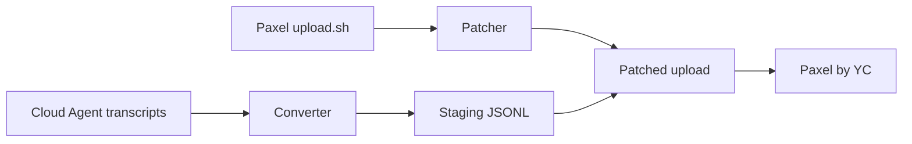

# Cursor Cloud to Paxel Converter

Unofficial bridge that uploads **Cursor Cloud Agent** sessions to [Paxel by YC](https://paxel.ycombinator.com).

Paxel helps founders reflect on how they build by ingesting AI coding session transcripts. Its official `upload.sh` only reads **local** history — Claude (`~/.claude`), Codex (`~/.codex`), and desktop Cursor (`workspaceStorage`). **Cursor Cloud Agents** run in remote pods; their transcripts live in Cursor's cloud, not on your machine.

This tool closes that gap:

1. **Exports** Cloud Agent transcripts (via Cursor MCP or manual export)
2. **Converts** them to Paxel's Cursor JSONL format
3. **Patches** Paxel's `upload.sh` to import the staging directory
4. **Uploads** from your project directory

## Documentation

| Guide | Description |
|-------|-------------|
| [Getting started](docs/getting-started.md) | Install, export, and run your first upload |
| [Exporting transcripts](docs/exporting-transcripts.md) | MCP workflow and manual export |
| [Architecture](docs/architecture.md) | Pipeline, data flow, and Paxel patches |
| [Reference](docs/reference.md) | CLI flags, env vars, formats, tool mapping |
| [Troubleshooting](docs/troubleshooting.md) | Common errors and fixes |

## How it works



## Quick start

### Prerequisites

- Python 3.8+, `curl`, `bash`
- Docker (required by Paxel)
- Cursor Cloud MCP access (for automated export) or a manual export — see [Exporting transcripts](docs/exporting-transcripts.md)

### 1. Install

```bash
git clone https://github.com/Salestrics/Cursor-Cloud-to-Paxel-Converter.git
cd Cursor-Cloud-to-Paxel-Converter
chmod +x automate-bridge.sh paxel-upload-with-cloud-agents.sh
```

### 2. Automate the bridge (recommended)

From a **Cursor Agent** with Cloud MCP access:

```bash
# Optional: skip browser sign-in
export YC_TOKEN="your-paxel-token"

# 1) Agent calls list-cloud-agents + batch-fetch-details (include_transcripts: true)
# 2) Then run one command:
./automate-bridge.sh /path/to/your/project --since 2m
```

`automate-bridge.sh` auto-detects the latest MCP export under `/tmp/cursor/cloud-agent-transcripts`, merges it into `<project>/cloud-agent-transcripts-export`, converts to Paxel JSONL, patches `upload.sh`, and uploads.

Useful flags:

| Flag | Purpose |
|------|---------|
| `--sync-only` | Merge MCP export only (no Paxel upload) |
| `--no-sync` | Skip MCP merge; use existing project export |
| `--force-sync` | Re-fetch agents already in the export |
| `--zip` | Refresh `cloud-agent-transcripts-export.zip` after merge |

### 3. Manual export + upload

If you already have an export at `<project>/cloud-agent-transcripts-export`:

```text
cloud-agent-transcripts-export/
  index.json
  bc-<agent-id>/
    transcript.json
```

```bash
./paxel-upload-with-cloud-agents.sh /path/to/your/project --since 2m
```

Full MCP export instructions: [Exporting transcripts](docs/exporting-transcripts.md).

### 4. Keep the export zip updated in your repo (shell)

For repos that track `cloud-agent-transcripts-export.zip` in git:

```bash
# One-time setup in your project repo
cd /path/to/your/project
# place or unzip your export, then:

# Refresh zip + commit (and optionally push)
/path/to/Cursor-Cloud-to-Paxel-Converter/refresh-repo-export.sh "$PWD" --push

# Upload to Paxel from the existing export (refreshes + commits zip automatically)
/path/to/Cursor-Cloud-to-Paxel-Converter/automate-bridge.sh "$PWD" \
  --no-sync --since 2m --commit-export --push-export
```

After a Cursor Agent pulls new MCP transcripts, re-run with sync enabled to merge new agents, refresh the zip, and commit:

```bash
./automate-bridge.sh /path/to/your/project --zip --commit-export --push-export
```

## Suggested Cursor prompts

Copy these into a **Cursor Agent** (desktop or cloud) when you want the agent to handle export and upload for you. Replace placeholders like `<your-project>` with your paths.

### One-command bridge (recommended)

```text
Automate the Cursor Cloud → Paxel bridge for my project.

Converter repo: <path-to-Cursor-Cloud-to-Paxel-Converter>
Project: <your-project>   (absolute path, must be a git repo)

Please:
1. Clone the converter repo if needed and chmod +x automate-bridge.sh.
2. Call list-cloud-agents for this repository (paginate; prefer did_make_code_changes: true).
3. Call batch-fetch-details with include_transcripts: true for all relevant bc_ids (max 50 per call).
4. Run ./automate-bridge.sh <your-project> --since 2m --zip from the converter repo.
5. Report how many agents were merged and whether the Paxel upload succeeded.
```

### Incremental update

```text
Update my Paxel cloud-agent export with new Cursor Cloud Agent sessions.

Project: <your-project>
Converter repo: <path-to-Cursor-Cloud-to-Paxel-Converter>

Please:
1. Read <your-project>/cloud-agent-transcripts-export/index.json for existing bc_ids.
2. Call list-cloud-agents and find agents not yet exported.
3. Call batch-fetch-details with include_transcripts: true for only the new bc_ids.
4. Run ./automate-bridge.sh <your-project> --since 2m --zip (incremental merge is automatic).
5. Summarize which new agents were added and whether the upload succeeded.
```

> **Tip:** `merge-cloud-agent-export.py` skips agents already in the export. The converter re-processes every agent on each upload — merging new sessions into the existing export is the simplest way to keep history.

## Manual conversion

Convert without uploading:

```bash
python3 convert-cloud-agent-transcripts-to-paxel.py \
  --export-dir cloud-agent-transcripts-export \
  --workspace /path/to/your/project \
  --output-dir ~/.paxel/cloud-agent-cursor-staging
```

See [Reference](docs/reference.md) for all CLI options and environment variables.

## Environment variables

| Variable | Default | Description |
|----------|---------|-------------|
| `EXPORT_DIR` | `<project>/cloud-agent-transcripts-export` | Transcript export directory |
| `PAXEL_CLOUD_AGENT_CURSOR_DIR` | `~/.paxel/cloud-agent-cursor-staging` | Staging output directory |
| `YC_TOKEN` | *(unset)* | Paxel API token (optional) |

## Tool name mapping

Cloud Agent tool names are normalized to Paxel's Cursor names:

| Cloud Agent | Paxel |
|-------------|-------|
| `run_terminal_cmd`, `Shell` | `Bash` |
| `read`, `read_file`, `Read` | `Read` |
| `write`, `StrReplace`, `Edit` | `Edit` |
| `grep`, `Grep` | `Grep` |
| `glob_file_search`, `Glob` | `Glob` |
| `Task` | `Task` |

Full mapping table: [Reference](docs/reference.md#tool-name-mapping).

## Files

| File | Purpose |
|------|---------|
| `automate-bridge.sh` | **One-command** MCP sync + convert + Paxel upload |
| `refresh-repo-export.sh` | Refresh export zip in a project repo and git commit it |
| `merge-cloud-agent-export.py` | Incremental merge of MCP batch-fetch into project export |
| `convert-cloud-agent-transcripts-to-paxel.py` | Cloud transcript → Paxel JSONL converter |
| `patch-paxel-for-cloud-agents.py` | Patches downloaded Paxel `upload.sh` |
| `paxel-upload-with-cloud-agents.sh` | Convert + patch + upload (no MCP sync) |
| `docs/` | Detailed guides |

## Limitations

- **Unofficial** — not endorsed by Cursor or YC; Paxel's `upload.sh` may change
- **No incremental sync** — each upload re-converts all agents in the export (merge is incremental; conversion is not)
- **Patch fragility** — eight in-place edits to Paxel's script; see [Architecture](docs/architecture.md)

## License

MIT © 2026 Salestrics
