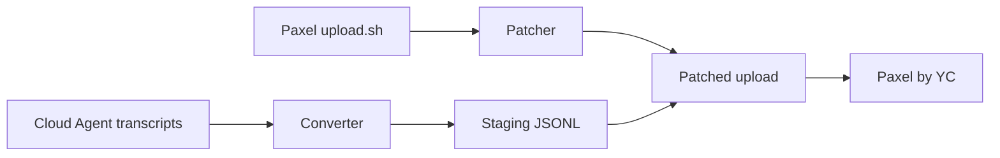

# Cursor Cloud to Paxel Converter

Unofficial bridge that uploads **Cursor Cloud Agent** sessions to [Paxel by YC](https://paxel.ycombinator.com).

Paxel helps founders reflect on how they build by ingesting AI coding session transcripts. Its official `upload.sh` only reads **local** history — Claude (`~/.claude`), Codex (`~/.codex`), and desktop Cursor (`workspaceStorage`). **Cursor Cloud Agents** run in remote pods; their transcripts live in Cursor's cloud, not on your machine.

This tool closes that gap:

1. **Exports** Cloud Agent transcripts (via Cursor MCP or manual export)
2. **Converts** them to Paxel's Cursor JSONL format
3. **Patches** Paxel's `upload.sh` to import the staging directory
4. **Uploads** from your project directory

## Documentation

| Guide | Description |
|-------|-------------|
| [Getting started](docs/getting-started.md) | Install, export, and run your first upload |
| [Exporting transcripts](docs/exporting-transcripts.md) | MCP workflow and manual export |
| [Architecture](docs/architecture.md) | Pipeline, data flow, and Paxel patches |
| [Reference](docs/reference.md) | CLI flags, env vars, formats, tool mapping |
| [Troubleshooting](docs/troubleshooting.md) | Common errors and fixes |

## How it works



## Quick start

### Prerequisites

- Python 3.8+, `curl`, `bash`
- Docker (required by Paxel)
- Exported Cloud Agent transcripts — see [Exporting transcripts](docs/exporting-transcripts.md)

### 1. Install

```bash
git clone https://github.com/Salestrics/Cursor-Cloud-to-Paxel-Converter.git
cd Cursor-Cloud-to-Paxel-Converter
chmod +x paxel-upload-with-cloud-agents.sh
```

### 2. Export transcripts

Place an export with this layout at `<project>/cloud-agent-transcripts-export`:

```text
cloud-agent-transcripts-export/
  index.json
  bc-<agent-id>/
    transcript.json
```

The fastest path is the Cursor Cloud MCP `batch-fetch-details` tool with `include_transcripts: true`. Full instructions: [Exporting transcripts](docs/exporting-transcripts.md).

### 3. Upload

```bash
# Optional: skip browser sign-in
export YC_TOKEN="your-paxel-token"

# From anywhere, pointing at your project:
./paxel-upload-with-cloud-agents.sh /path/to/your/project --since 2m
```

The wrapper converts transcripts, downloads and patches Paxel's `upload.sh`, and runs the upload from your project.

## Suggested Cursor prompts

Copy these into a **Cursor Agent** (desktop or cloud) when you want the agent to handle export and upload for you. Replace placeholders like `<your-project>` and `<repo-url>` with your paths.

### First-time conversion

Use this when you are converting Cloud Agent sessions to Paxel for the first time:

```text
I want to upload my Cursor Cloud Agent sessions to Paxel using the Cursor Cloud to Paxel Converter.

Repo: https://github.com/Salestrics/Cursor-Cloud-to-Paxel-Converter
Project to upload: <your-project>   (absolute path, must be a git repo)

Please:
1. Clone the converter repo if needed and make paxel-upload-with-cloud-agents.sh executable.
2. Use the Cursor Cloud MCP tools to export transcripts for this repository:
   - Call list-cloud-agents with filters for agents that made code changes (paginate if needed).
   - Call batch-fetch-details with include_transcripts: true for all relevant bc_ids (max 50 per call).
3. Copy the export to <your-project>/cloud-agent-transcripts-export with index.json and bc-<id>/transcript.json per agent.
4. Zip the export as <your-project>/cloud-agent-transcripts-export.zip for easy reuse.
5. Run ./paxel-upload-with-cloud-agents.sh <your-project> --since 2m from the converter repo.
6. Tell me how many agents were exported and whether the Paxel upload succeeded.
```

### Updating with new cloud pulls

Use this when you already have an export (and zip) and want to pull in new Cloud Agent sessions:

```text
Update my Paxel cloud-agent export with new Cursor Cloud Agent sessions.

Project: <your-project>   (absolute path)
Existing export: <your-project>/cloud-agent-transcripts-export
Existing zip (if present): <your-project>/cloud-agent-transcripts-export.zip
Converter repo: <path-to-Cursor-Cloud-to-Paxel-Converter>

Please:
1. Read the existing export's index.json and note which bc_ids are already included.
2. Use list-cloud-agents for this repository and find agents not yet in the export (prefer did_make_code_changes: true; use created_after if you know the last export date).
3. Call batch-fetch-details with include_transcripts: true for only the new bc_ids.
4. Merge the new agents into cloud-agent-transcripts-export (append to index.json; add bc-<id>/transcript.json folders). Do not remove existing agents unless I ask.
5. Refresh cloud-agent-transcripts-export.zip from the updated export directory.
6. Re-run ./paxel-upload-with-cloud-agents.sh <your-project> --since 2m.
7. Summarize which new agents were added and whether the upload succeeded.
```

> **Tip:** The converter re-processes every agent in the export on each run — merging new sessions into the existing export (and zip) is the simplest way to keep history while adding new cloud pulls.

## Manual conversion

Convert without uploading:

```bash
python3 convert-cloud-agent-transcripts-to-paxel.py \
  --export-dir cloud-agent-transcripts-export \
  --workspace /path/to/your/project \
  --output-dir ~/.paxel/cloud-agent-cursor-staging
```

See [Reference](docs/reference.md) for all CLI options and environment variables.

## Environment variables

| Variable | Default | Description |
|----------|---------|-------------|
| `EXPORT_DIR` | `<project>/cloud-agent-transcripts-export` | Transcript export directory |
| `PAXEL_CLOUD_AGENT_CURSOR_DIR` | `~/.paxel/cloud-agent-cursor-staging` | Staging output directory |
| `YC_TOKEN` | *(unset)* | Paxel API token (optional) |

## Tool name mapping

Cloud Agent tool names are normalized to Paxel's Cursor names:

| Cloud Agent | Paxel |
|-------------|-------|
| `run_terminal_cmd`, `Shell` | `Bash` |
| `read`, `read_file`, `Read` | `Read` |
| `write`, `StrReplace`, `Edit` | `Edit` |
| `grep`, `Grep` | `Grep` |
| `glob_file_search`, `Glob` | `Glob` |
| `Task` | `Task` |

Full mapping table: [Reference](docs/reference.md#tool-name-mapping).

## Files

| File | Purpose |
|------|---------|
| `convert-cloud-agent-transcripts-to-paxel.py` | Cloud transcript → Paxel JSONL converter |
| `patch-paxel-for-cloud-agents.py` | Patches downloaded Paxel `upload.sh` |
| `paxel-upload-with-cloud-agents.sh` | End-to-end wrapper script |
| `docs/` | Detailed guides |

## Limitations

- **Unofficial** — not endorsed by Cursor or YC; Paxel's `upload.sh` may change
- **No incremental sync** — each run re-converts all agents in the export
- **Patch fragility** — eight in-place edits to Paxel's script; see [Architecture](docs/architecture.md)

## License

MIT © 2026 Salestrics
