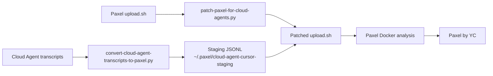

# Architecture

How the Cursor Cloud to Paxel bridge works end to end.

## Problem

Paxel ingests AI coding session transcripts to help YC founders reflect on how they build. Its official `upload.sh` collects sessions from:

| Source | Location |
|--------|----------|
| Claude Code | `~/.claude/` |
| Codex | `~/.codex/` |
| Desktop Cursor | `workspaceStorage` SQLite DB |
| OpenCode, Gemini, VS Code | Various local paths |

Cursor **Cloud Agents** run in remote pods. Their transcripts live in Cursor's cloud infrastructure, not on your machine. This converter closes that gap.

## Pipeline overview



## Components

### 1. Converter (`convert-cloud-agent-transcripts-to-paxel.py`)

Reads the export layout (`index.json` + per-agent `transcript.json`) and writes Paxel-compatible Cursor JSONL files.

**Key behaviors:**

- Resolves git remote from `origin` (or `--git-remote` override), normalizing SSH URLs to HTTPS
- Groups sessions into a bucket directory: `_cursor_<projectName>_<hash6>/`
- Embeds `_cursor_meta` on the first JSONL line with `composerId`, `workspace`, `git_remote`, `agent_type`, and `cloud_agent_name`
- Maps Cloud Agent tool names to Paxel's Cursor names (see [Reference](reference.md))
- Remaps tool input fields (e.g. `target_file` → `file_path`, `command` → `cmd`)
- Truncates tool results to 4000 characters
- Writes `_metadata.json` and `manifest.json` for staging bookkeeping

### 2. Patcher (`patch-paxel-for-cloud-agents.py`)

Downloads Paxel's `upload.sh` is fetched fresh on each run. The patcher applies seven in-place edits so Paxel recognizes cloud staging:

| # | Patch | Purpose |
|---|-------|---------|
| 1 | `collect_cursor_sessions()` | Copies JSONL from `PAXEL_CLOUD_AGENT_CURSOR_DIR` into Paxel's temp session dir |
| 2 | `session_count` (project picker) | Includes cloud import count so Paxel doesn't think there are zero sessions |
| 3 | `session_count` (single-repo) | Same for single-repo auto-detect path |
| 4 | Auto-detect | Skips "none match" prompt when cloud staging has sessions |
| 5 | `maybe_prescan_cursor_remotes` | Reads git remotes from staging JSONL metadata (no local Cursor DB needed) |
| 6 | `_paxel_should_run_cursor_extraction()` | Helper injected before `run_docker_analysis()` |
| 7 | Docker cursor mount gate | Uses the helper — cloud imports don't require `jq`/`sqlite3` |
| 8 | Missing-tools hint | Suppressed when cloud staging is in use |

Patches are idempotent: re-running skips already-applied edits.

### 3. Wrapper (`paxel-upload-with-cloud-agents.sh`)

Orchestrates the full flow:

1. Resolve export directory
2. Run converter → staging
3. Download + patch Paxel upload script
4. Export `PAXEL_CLOUD_AGENT_CURSOR_DIR`
5. `cd` to project and run patched upload

## Data flow

```text
Cloud export                          Paxel staging
─────────────                         ─────────────
index.json                    →       manifest.json
  agents[].bcId                         _metadata.json
  agents[].name
                                      _cursor_myapp_a1b2c3/
bc-abc123/transcript.json     →         bc-abc123.jsonl
  messages[]                              line 1: {_cursor_meta: ...}
  role: user|assistant|tool               line 2+: user/assistant/tool_result
```

## JSONL message format

Each line is a JSON object. The first line includes `_cursor_meta`:

```json
{
  "type": "user",
  "message": {"role": "user", "content": "Fix the bug"},
  "timestamp": "2026-07-14T01:00:00Z",
  "_cursor_meta": {
    "composerId": "bc-abc123",
    "workspace": "/path/to/project",
    "git_remote": "https://github.com/org/repo",
    "agent_type": "cursor",
    "cloud_agent_name": "Fix login bug"
  }
}
```

Assistant messages may include `thinking` blocks and `tool_use` entries. Tool results appear as `user` messages with `tool_result` content.

## Git remote matching

Paxel groups sessions by git remote. The converter:

1. Runs `git remote get-url origin` in the workspace
2. Normalizes SSH (`git@github.com:org/repo.git`) → HTTPS (`https://github.com/org/repo`)
3. Strips `.git` suffix
4. Embeds the result in every session's `_cursor_meta.git_remote`

When you upload from the same repo, Paxel auto-detects the project even without local Cursor history.

## Security notes

- The patcher modifies a **downloaded copy** of `upload.sh` in `/tmp` — your system is not permanently altered
- Transcripts may contain secrets, API keys, or proprietary code — treat exports accordingly
- `YC_TOKEN` is passed to Paxel's upload script; don't commit it

## Limitations

- **Unofficial** — not endorsed by Cursor or YC; Paxel's `upload.sh` format may change and break patches
- **No incremental sync** — each run re-converts all agents in the export
- **Tool name coverage** — unknown tool names pass through unchanged; see [Reference](reference.md) for the mapping table
- **Transcript fidelity** — thinking blocks and tool results are preserved, but Paxel's analysis may weight them differently than native Cursor sessions
